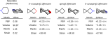

# SpiroHexane4Bioisostere : Novel Sulfonium Reagents for the Modular Synthesis of Spiro[2.3]hexanes

[](https://www.python.org/)
[](https://jupyter.org/)
[](https://orcaforum.kofo.mpg.de/)  
[](http://sobereva.com/multiwfn/)

This repository contains the data, scripts, and workflows associated with the publication:
**"Novel Sulfonium Reagents for the Modular Synthesis of Spiro[2.3]hexanes and Heteroatom-Containing Analogues: Synthesis, Application, and Evaluation as Bioisosteres."**



The project integrates **Python-based workflows** with **ORCA quantum chemistry calculations** and a few features from **MultiWFN** to enable reproducible and automatable analysis pipelines.

---

- [SpiroHexane4Bioisostere : Novel Sulfonium Reagents for the Modular Synthesis of Spiro\[2.3\]hexanes](#spirohexane4bioisostere--novel-sulfonium-reagents-for-the-modular-synthesis-of-spiro23hexanes)
  - [📘 Project Overview](#-project-overview)
  - [🔧 Methods and Tools](#-methods-and-tools)
    - [Programming Language](#programming-language)
    - [Quantum Chemistry Software](#quantum-chemistry-software)
  - [📁 Repository Structure](#-repository-structure)
    - [data](#data)
    - [figures](#figures)
    - [notebooks](#notebooks)
    - [scripts](#scripts)
    - [shell](#shell)
    - [src](#src)
  - [🚀 Getting Started](#-getting-started)
    - [Prerequisites](#prerequisites)
    - [Clone repository](#clone-repository)
    - [Python Environment setup](#python-environment-setup)
  - [🧪 Reproducibility](#-reproducibility)
    - [Initialize starting conformer by using MM method](#initialize-starting-conformer-by-using-mm-method)
    - [Cores Optimization](#cores-optimization)
    - [Critical points](#critical-points)
    - [Molecular characterization](#molecular-characterization)
    - [Chemical space reducted by PCA](#chemical-space-reducted-by-pca)
    - [Clustering](#clustering)
    - [Free Gibbs Energy of reactions](#free-gibbs-energy-of-reactions)
    - [Useful pictures](#useful-pictures)
  - [📚 Citation](#-citation)
  - [📜 License](#-license)

---

## 📘 Project Overview

The goal of this project is to investigate the structural, electronic, and energetic properties of organic molecules. By combining classical cheminformatics with quantum mechanical simulations, the framework supports:

- Molecular structure visualization
- Input generation for ORCA calculations
- Automated execution and parsing of ORCA output
- Data management and storage of simulation results
- Analysis notebooks for data visualization, processing and interpretation
- Utility scripts for workflow automation

---

## 🔧 Methods and Tools

### Programming Language

- **Python 3.13** was used for scripting, data processing, automation, and workflow management. Key libraries (see [`requirements.txt`](requirements.txt) for version specifications) includes:

  - `numpy`, `scipy`, `pandas` for numerical analysis
  - `matplotlib` for plotting
  - `rdkit` for cheminformatics and descriptors computation
  - `scikit-learn-extra` for `kmedoids` clustering algorithm
  - `Py3Dmol` and `svgutils` are also employed to generate images
  - Custom modules located in `src/`

### Quantum Chemistry Software

- **ORCA Version 5.0.4** was used for electronic structure calculations, including:
  - Geometry optimizations
  - Frequency calculations
  - Single-point energies
  - Molecular orbitals and charge analyses

- **Multiwfn Version 3.7** for post-processing of electron density files. Specifically was used to:
  - Analyze topological features according to **Quantum Theory of Atoms in Molecules (QTAIM)**, including extraction of **(+3,−1) critical points** (bond critical points) and their associated properties
  - Compute **Lagrangian kinetic energy** and related energetic descriptors at identified critical points (QTAIM)**
  - Extract scalar field information (**strain energy**)

---

## 📁 Repository Structure

### data

First sub-dir is referred to the project task : cores or reactions. Inside of each of them  input and output data files (raw and computed) can be found. For more details look at [cores/README.md](data/cores/README.md) or [reactions/README.md](data/reactions/README.md)

### figures

Directory dedicated to the figures employed for the publication. They are generated exclusively by codes in notebooks.

### notebooks

Jupyter notebooks for exploratory data analysis and some of them are part of the processing pipeline for results.

### scripts

Python scripts to be run exclusively to process data. All of them provides parsing of parameters. They are usually referred to directory name to compose final path, SMILES, etc. Command-line arguments can always be inspected using:

```bash
python scripts/script_name.py --help
```

> By default, the scripts automatically change work directory to the root path project

### shell

Shell scripts for running some pipeline steps by cycling SMILES from database to run python scripts comfortably.

### src

Custom modules and utilities to support scripts and notebooks

---

## 🚀 Getting Started

### Prerequisites

For the best reproducibility we recommend to employ same version of the following:

- **Python 3.13** installed
- **ORCA 5.0.4** installed and configure the relative path command for:
  - `run-orca` in script file [scripts/dft_opt.py line 1](scripts/dft_opt.py#L1)
  - `orca_2aim` in script file [scripts/strain_energy.py line 1](scripts/strain_energy.py#L1)
- **Multiwfn 3.7** installed and configure the relative path command for:
  - `Multiwfn` in script file [scripts/strain_energy.py line 2](scripts/strain_energy.py#L2)

### Clone repository

To get started, clone the repository using:

```bash
git clone https://github.com/f48r1/spirohexane4bioisostere && \
cd spirohexane4bioisostere
```

### Python Environment setup

Create a virtual environment and install dependencies:

```bash
python -m venv .venv &&\
source .venv/bin/activate &&\
pip install -r requirements.txt
```

---

## 🧪 Reproducibility

To ensure full reproducibility of the workflow, all steps in the pipeline must be executed using one of the following approaches:

- **Python scripts** located in `scripts/`
- **Bash shell utilities** located in `shell/`
- **Jupyter notebooks** in `notebooks/`

Some command-line arguments of Python scripts are optional and have default values, while others must be explicitly provided depending on the calculation or preprocessing task. By the way, if the following pipeline is executed, arguments are not required to be inspected.

### Initialize starting conformer by using MM method

Initialize the starting molecular conformer using the molecular mechanics (MM) approach. This can be done by running the Python script:

```bash
python scripts/init_MM.py
```

Resulted .mol files will be stored (as default) in [data/cores/MM/](data/cores/MM/)

### Cores Optimization

Now it is time to optimize the previously initialized conformational structures.
This procedure can be carried out using a dedicated Python script [scripts/dft_opt.py](scripts/dft_opt.py), where the **SMILES string** and the **quantum-mechanical setup** must be provided as command-line arguments. Alternatively, the same QM setup used in this work can be reproduced exactly by running the corresponding Bash script, ensuring methodological consistency.
Run the following command in bash to run optimization for all structures (already computed structures will be ignored) :

```bash
bash shell/dft_cores.sh
```

Optimization outputs are stored in [data/cores/DFT](data/cores/DFT), while optimized structures as .mol files are stored in [data/cores/opt_mol](data/cores/opt_mol).

### Critical points

Critical points of the molecular structures are required to compute the strain energy.  
This procedure can be carried out using a dedicated Python script [scripts/strain_energy.py](scripts/strain_energy.py), where the **SMILES string** and the **quantum-mechanical setup** must be provided as command-line arguments.
Alternatively, run the following command in bash to run calculations for all structures:

```bash
bash shell/strain_energy.sh
```

### Molecular characterization

Optimized molecular structures were characterized by molecular descriptors provided by RDKit and, in addition, a few QM characteristics extracted from DFT output.
Run python scripts to compute descriptors:

```bash
python scripts/describe.py
```

The output file is stored in [descripted.csv](data/cores/computed/descripted.csv)

The relative description analysis was performed in [descriptions_analysis.ipynb](notebooks/descriptions_analysis.ipynb). Moreover, the notebook filter out some negligible descriptors and store results in data/[descripted_def.csv](data/cores/computed/descripted_def.csv)

### Chemical space reducted by PCA

[PCA.ipynb](notebooks/PCA.ipynb) notebook file performs the PCA on the descriptor matrix and stores the result in data/[cores/computed/PCAscore.csv](data/cores/computed/PCAscore.csv) file. Also, an outliers detection is made and some molecules are filtered out. The final result is stored in [data/cores/computed/PCAscore_def.csv](data/cores/computed/PCAscore_def.csv).

### Clustering

A clusterization was made on the PCA 3D space, by using (as default) `kmedoids` algorithm, excluding molecules considered as outliers.
To perform the clustering:

```bash
python scripts/clustering.py
```

The results will be stored in [data/cores/computed/clusterizer=kmedoids](data/cores/computed/clusterizer=kmedoids) providing either global and local metrics by varying the number of clusters. Random seed was set to 0 as default for the reproducibility.

Finally, the clustering results were analyzed by using [cluster_analysis.ipynb](notebooks/cluster_analysis.ipynb) notebook file. Furthermore, the optimal number of clusters is investigated and resulted to be **5** !

### Free Gibbs Energy of reactions

ΔG for different reactions yelding to the carben product were computed by additional DFT calculations.
To perform the calc, run the bash script:

```bash
bash shell/dft_reactions.sh
```

The resulted optimized structures are stored in [data/reactions](data/reactions) folder analogously to cores optimization.

### Useful pictures

Definitive figures for computational discussions were generated using [plot_clusters.ipynb](notebooks/plot_clusters.ipynb), [beautiful_cores.ipynb](notebooks/beautiful_cores.ipynb) and [gibbs.ipynb](notebooks/gibbs.ipynb) notebook files.
Enjoy !

---

## 📚 Citation

If you use this repository in academic work, please cite the corresponding scientific article associated with this project.

You can cite it in BibTeX format:

```bibtex
@article{spirohexane4bioisostere2025,
  title={Novel Sulfonium Reagents for the Modular Synthesis of Spiro[2.3]hexanes and Heteroatom-Containing Analogues: Synthesis, Application, and Evaluation as Bioisosteres},
}
```

---

## 📜 License

This project is licensed under the [**MIT License**](LICENSE).
